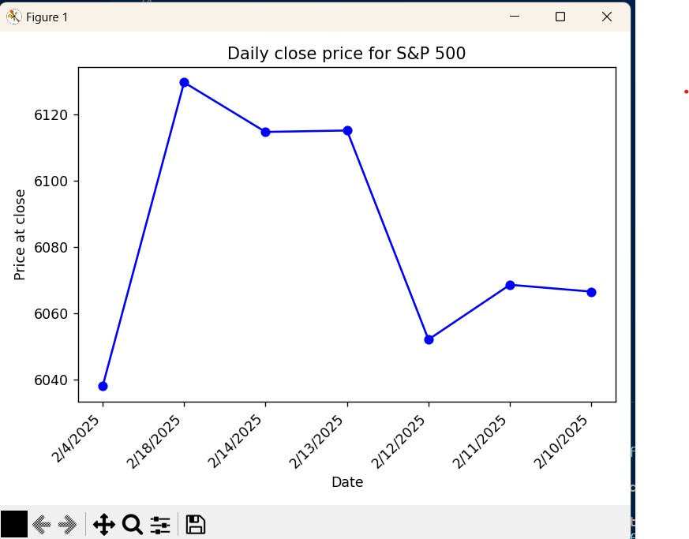

# Project-06-Moss

This code is designed to consume stock data from a Kafka topic and store the data in a JSON file, while also displaying live updates of the stock data on a chart. It begins by importing necessary modules, including those for Kafka communication, logging, and data visualization with Matplotlib. The main functionality revolves around reading messages from Kafka, processing the stock data, and updating both a JSON file and a live chart with the stock's close prices over time. It keeps the last 30 stock data points and dynamically updates the chart with each new message, showing the change in stock price over time.




## Run the project
### Activate the Python Virtual Environment

```shell

py -m venv .venv
.venv\Scripts\Activate
py -m pip install -r requirements.txt

```

### 1. Start WSL Terminal

```shell
Terminal 1

PS C:\Users\nolan> wsl
moss@InspironNolan:~$ cd ~/kafka
moss@InspironNolan:~/kafka$ bin/zookeeper-server-start.sh config/zookeeper.properties


Terminal 2

PS C:\Users\nolan> wsl
moss@InspironNolan:/mnt/c/Users/nolan$ cd ~/kafka
moss@InspironNolan:~/kafka$ bin/kafka-server-start.sh config/server.properties
```


### 2. Start Producer and Consumer 

```shell
.venv\Scripts\activate
py -m producers.producer_moss


.venv\Scripts\activate
py -m consumers.consumer_moss

```
